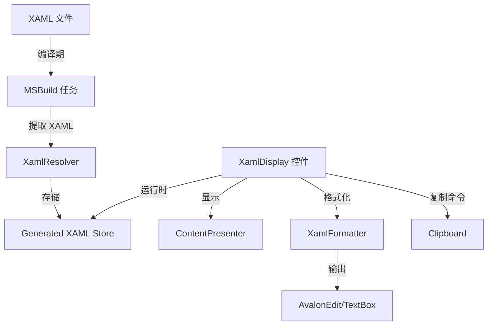

## 项目概述

将项目中的 XamlDisplay 控件从当前简化实现升级为完整的 ShowMeTheXAML 实现，包含所有必要的辅助类（XamlPresenter、XamlResolver、格式化器、构建任务等），达到 MaterialDesignInXamlToolkit 示例的完整功能效果。

## 核心功能

- **完整的 XamlDisplay 控件**：支持自动 XAML 提取、格式化、复制、折叠展开
- **构建时 XAML 提取**：通过 MSBuild 任务在编译期提取 XAML 内容，避免运行时性能开销
- **XAML 格式化器**：自动格式化 XAML 代码，添加缩进和换行
- **AvalonEdit 集成**：支持语法高亮的代码编辑器显示
- **样式统一**：更新所有 XAML 引用，确保控件样式与 MaterialDesignInXamlToolkit 一致

## 视觉效果

- 卡片式布局，包含控件演示区和可折叠的 XAML 代码区
- Material Design 风格的展开/折叠动画
- 深色主题的代码块，类似 VS Code 的语法高亮
- 一键复制代码到剪贴板的功能按钮
- 流畅的悬停和交互动效

## 技术栈

- **框架**：.NET 8.0 + WPF
- **语言**：C# 12
- **构建工具**：MSBuild 自定义任务
- **编辑器组件**：AvalonEdit (用于 XAML 语法高亮)

## 系统架构

### 整体架构



### 模块划分

1. **XamlDisplay 核心模块**（LOLThemes.Wpf.ShowMeTheXAML）

- XamlDisplay.cs：主控件，继承自 ContentControl
- XamlDisplayAttribute.cs：标记 XAML 内容的特性
- XamlFormatter.cs：XAML 格式化逻辑
- TextDocumentValueConverter.cs：AvalonEdit 文档转换器

2. **构建时解析模块**（LOLThemes.Wpf.ShowMeTheXAML.Build）

- XamlResolver.cs：XAML 提取和解析器
- MSBuild 任务：编译期执行 XAML 提取

3. **XAML 资源模块**

- XamlDisplayStyles.xaml：控件样式定义
- Generic.xaml：默认主题资源

### 数据流

1. **编译期流程**：

- MSBuild 任务扫描所有 `[XamlDisplay]` 特性标记的控件
- XamlResolver 提取控件内的 XAML 内容
- 生成静态类存储所有 XAML 字符串，以 UniqueKey 为键

2. **运行时流程**：

- XamlDisplay 控件加载时通过 UniqueKey 从存储中获取 XAML
- XamlFormatter 格式化 XAML 字符串（添加缩进、换行）
- 格式化后的 XAML 显示在 AvalonEdit 或 TextBox 中
- 用户点击复制按钮时，XAML 内容复制到剪贴板

## 实现细节

### 核心文件结构

```
src/LOLThemes.Wpf/
├── ShowMeTheXAML/
│   ├── XamlDisplay.cs                  # 主控件
│   ├── XamlDisplayAttribute.cs         # 特性标记
│   ├── XamlFormatter.cs                # XAML 格式化
│   ├── TextDocumentValueConverter.cs   # AvalonEdit 转换器
│   └── XamlResolver.cs                 # 构建时解析器
├── Themes/
│   ├── Generic.xaml                    # 默认样式
│   └── Styles/
│       └── XamlDisplayStyles.xaml      # XamlDisplay 样式
```

### 关键技术实现

**XamlDisplayAttribute**：用于标记需要提取 XAML 的控件

```
[AttributeUsage(AttributeTargets.Class, AllowMultiple = false)]
public class XamlDisplayAttribute : Attribute
{
    public string UniqueKey { get; }
    public XamlDisplayAttribute(string uniqueKey)
    {
        UniqueKey = uniqueKey;
    }
}
```

**XamlFormatter**：格式化 XAML 字符串，添加缩进和换行

```
public static class XamlFormatter
{
    public static string Format(string xaml)
    {
        // 实现 XAML 格式化逻辑
        // 1. 解析 XAML 字符串
        // 2. 添加适当缩进
        // 3. 标准化属性排列
        // 4. 返回格式化后的字符串
    }
}
```

**MSBuild 任务配置**：在 .csproj 中添加构建任务

```xml
<Target Name="GenerateXamlDisplayCache" BeforeTargets="BeforeBuild">
  <XamlDisplayResolver 
    AssemblyPath="$(TargetPath)" 
    OutputPath="$(IntermediateOutputPath)XamlDisplayCache.g.cs" />
</Target>
```

## 技术考量

### 性能优化

- 构建时提取 XAML 避免运行时性能开销
- 使用静态字典存储 XAML 内容，O(1) 查询复杂度
- AvalonEdit 使用虚拟化技术处理大段代码
- 延迟加载代码区域，仅在展开时渲染

### 依赖管理

- 移除外部 ShowMeTheXAML 包引用
- 内部实现所有核心功能
- AvalonEdit 作为可选依赖（支持回退到 TextBox）

### 错误处理

- 缺失 XAML 键值时显示友好错误提示
- 格式化失败时显示原始 XAML
- 构建时错误记录到 MSBuild 日志