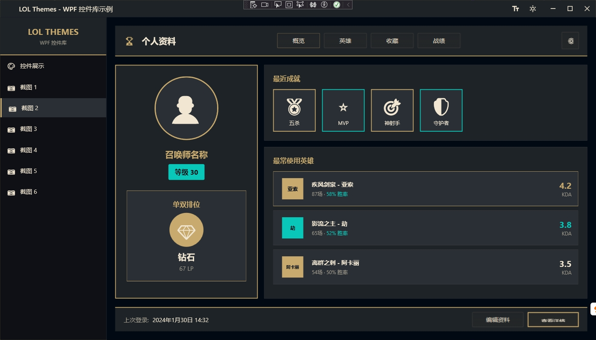
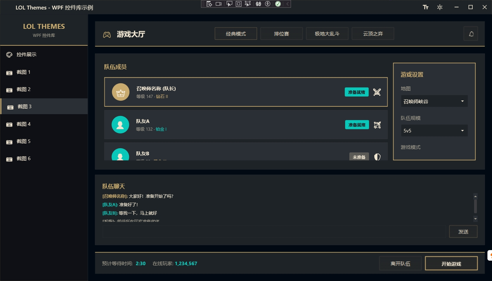
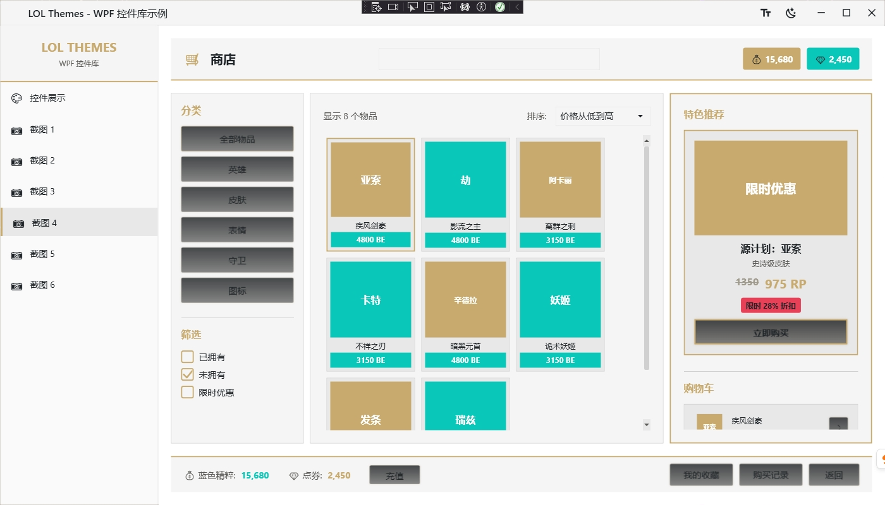
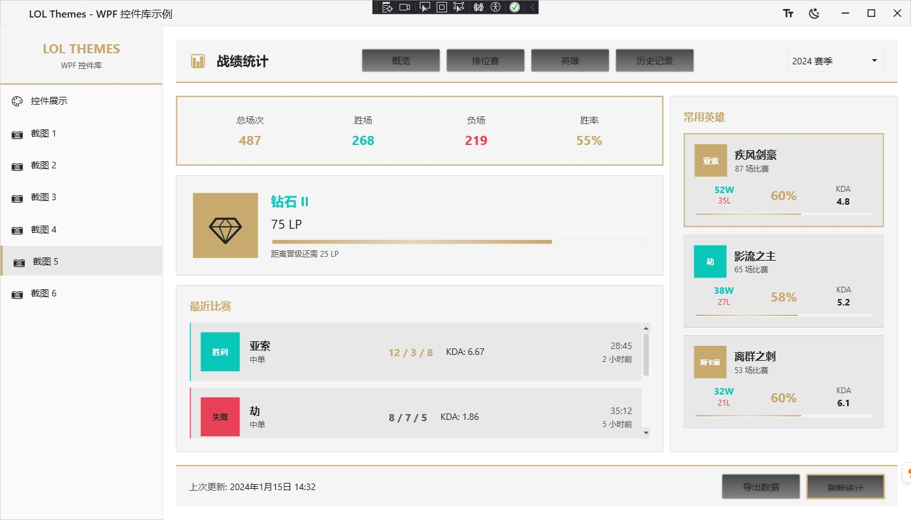
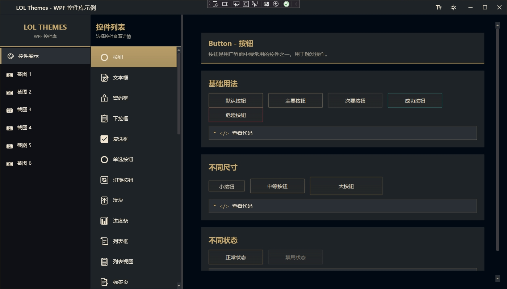

# LOLThemes.Wpf - League of Legends Style WPF Control Library

<div align="center">

[English](README.md) | [中文文档](README.zh.md)

</div>

> **🤖 This project is completely generated by AI IDE (Kiro) / Cursor!**  
> This is an open-source project showcasing AI-assisted development capabilities, where the entire process from requirements analysis, design, to implementation was completed by AI, with human oversight for technical direction.

## 📖 Overview

LOLThemes.Wpf is an open-source WPF control library for .NET 8 desktop applications, providing the visual style of the League of Legends game client. The project includes a complete set of themed controls, enabling developers to easily create desktop applications with the authentic League of Legends aesthetic.

## ✨ Features

- 🎨 **Complete Theme System** - Features the iconic gold and dark blue color scheme from League of Legends
- 🌓 **Dual Theme Support** - Dark and light themes with runtime dynamic switching
- 📏 **Size Theme System** - Three size themes (Compact, Medium, Large) for different use cases
- 🎯 **28+ Base Control Styles** - Covers all commonly used WPF controls
- 🔧 **5 Custom Controls** - Hexagon buttons, glow buttons, champion cards, and more
- 📦 **Minimal Dependencies** - Only requires WPF framework and Material.Icons.WPF (for icons)
- 🎭 **Smooth Animations** - Hover, click, focus, and other interactive animations
- 🔌 **Easy Integration** - Apply themes through resource dictionaries
- 🎮 **1:1 UI Recreation** - Sample application showcases game interface recreation
- 🏗️ **MVVM Architecture** - Sample application uses MVVM pattern for easy learning and extension

## 🖼️ Screenshots

The project includes multiple interface recreation examples showcasing the control library in action:







## 🚀 Quick Start

### Installation

#### Method 1: Build from Source

```bash
# Clone the repository
git clone https://github.com/yourusername/LOLThemes.git
cd LOLThemes

# Build the control library
dotnet build src/LOLThemes.Wpf/LOLThemes.Wpf.csproj

# Run the sample application
dotnet run --project src/LOLThemes.Wpf.Samples/LOLThemes.Wpf.Samples.csproj
```

#### Method 2: NuGet Package (Coming Soon)

```bash
dotnet add package LOLThemes.Wpf
```

### Integration Guide - 5 Steps to Integrate LOLThemes.Wpf

#### Step 1: Add Project Reference

In your WPF project, add a reference to the `LOLThemes.Wpf` project:

```xml
<ProjectReference Include="path\to\LOLThemes.Wpf\LOLThemes.Wpf.csproj" />
```

Or via NuGet (coming soon):
```bash
dotnet add package LOLThemes.Wpf
```

#### Step 2: Reference Theme Resources in App.xaml

Reference `Generic.xaml` and default theme resources in `App.xaml`:

```xml
<Application x:Class="YourApp.App"
             xmlns="http://schemas.microsoft.com/winfx/2006/xaml/presentation"
             xmlns:x="http://schemas.microsoft.com/winfx/2006/xaml">
    <Application.Resources>
        <ResourceDictionary>
            <ResourceDictionary.MergedDictionaries>
                <!-- Reference LOLThemes.Wpf theme resources -->
                <ResourceDictionary Source="pack://application:,,,/LOLThemes.Wpf;component/Themes/Generic.xaml"/>
                
                <!-- Directly reference default theme and size resources (supports runtime dynamic switching) -->
                <ResourceDictionary Source="pack://application:,,,/LOLThemes.Wpf;component/Themes/Colors.Dark.xaml"/>
                <ResourceDictionary Source="pack://application:,,,/LOLThemes.Wpf;component/Themes/Sizes.Medium.xaml"/>
            </ResourceDictionary.MergedDictionaries>
        </ResourceDictionary>
    </Application.Resources>
</Application>
```

> **Important Notes:**
> - `Generic.xaml` contains all control styles and font resources
> - You must directly reference `Colors.xxx.xaml` and `Sizes.xxx.xaml` in `App.xaml` for `ThemeManager` to support runtime dynamic switching
> - Do not reference `Colors.xaml` or `Sizes.xaml` in `Generic.xaml` (they have been removed)

#### Step 3: Use Control Styles in Window

All controls automatically apply LOL theme styles without additional setup (using implicit styles):

```xml
<Window x:Class="YourApp.MainWindow"
        xmlns="http://schemas.microsoft.com/winfx/2006/xaml/presentation"
        xmlns:x="http://schemas.microsoft.com/winfx/2006/xaml">
    <StackPanel Margin="20">
        <!-- Default styles apply automatically -->
        <Button Content="Default Button" Width="200" Height="40" Margin="0,10"/>
        
        <!-- Or use named styles -->
        <Button Content="Primary Button" 
                Style="{StaticResource LOLPrimaryButtonStyle}" 
                Width="200" Height="40" Margin="0,10"/>
        
        <!-- TextBox automatically applies styles -->
        <TextBox Width="200" Height="35" Margin="0,10"/>
        
        <!-- ComboBox automatically applies styles -->
        <ComboBox Width="200" Height="35" Margin="0,10">
            <ComboBoxItem Content="Option 1"/>
            <ComboBoxItem Content="Option 2"/>
            <ComboBoxItem Content="Option 3"/>
        </ComboBox>
    </StackPanel>
</Window>
```

#### Step 4: Use Custom Controls and Attached Properties

```xml
<Window xmlns:lol="clr-namespace:LOLThemes.Wpf.Controls;assembly=LOLThemes.Wpf"
        xmlns:helpers="clr-namespace:LOLThemes.Wpf.Helpers;assembly=LOLThemes.Wpf">
    <StackPanel Margin="20">
        <!-- Use custom controls -->
        <lol:HexagonButton Content="Hexagon" Width="120" Height="120"/>
        
        <!-- Use attached properties -->
        <TextBox helpers:TextBoxHelper.Placeholder="Enter username..." Width="200"/>
    </StackPanel>
</Window>
```

#### Step 5: Implement Runtime Theme Switching

Use `ThemeManager` to dynamically switch themes and sizes at runtime:

```csharp
using LOLThemes.Wpf.Helpers;

// Switch color theme (Dark/Light)
ThemeManager.SwitchTheme(Theme.Light);  // Switch to light theme

// Switch size theme (Compact/Medium/Large)
ThemeManager.SwitchSizeTheme(SizeTheme.Large);  // Switch to large size

// Subscribe to theme change events
ThemeManager.ThemeChanged += (s, e) =>
{
    Console.WriteLine($"Theme switched to: {e.NewTheme}");
};

// Get current theme
Theme currentTheme = ThemeManager.CurrentTheme;
SizeTheme currentSize = ThemeManager.CurrentSizeTheme;
```

### Complete Example

Check out the `src/LOLThemes.Wpf.Samples` project for a complete integration example and best practices.

## 📦 Available Controls

### Base Control Styles

LOLThemes.Wpf provides complete styles for the following WPF base controls:

#### Input Controls
- ✅ **Button** - Button (Implemented)
- ✅ **TextBox** - Text input box (Implemented)
- ✅ **PasswordBox** - Password input box (Implemented)
- ✅ **ComboBox** - Combo box/Dropdown list (Implemented)
- ✅ **CheckBox** - Checkbox (Implemented)
- ✅ **RadioButton** - Radio button (Implemented)
- ✅ **ToggleButton** - Toggle button (Implemented)
- ✅ **Slider** - Slider (Implemented)

#### Display Controls
- ✅ **Label** - Label (Implemented)
- ✅ **TextBlock** - Text block (Implemented)
- ✅ **Image** - Image (Implemented)
- ✅ **ProgressBar** - Progress bar (Implemented)
- ✅ **ToolTip** - Tooltip (Implemented)

#### Container Controls
- ✅ **Border** - Border (Implemented)
- ✅ **GroupBox** - Group box (Implemented)
- ✅ **Expander** - Expander panel (Implemented)
- ✅ **TabControl** - Tab control (Implemented)
- ✅ **Window** - Window (Implemented)

#### List Controls
- ✅ **ListBox** - List box (Implemented)
- ✅ **ListView** - List view (Implemented)
- ✅ **DataGrid** - Data grid (Implemented)
- ✅ **TreeView** - Tree view (Implemented)

#### Menu Controls
- ✅ **Menu** - Menu bar (Implemented)
- ✅ **MenuItem** - Menu item (Implemented)
- ✅ **ContextMenu** - Context menu (Implemented)

#### Other Controls
- ✅ **ScrollBar** - Scroll bar (Implemented)
- ✅ **StatusBar** - Status bar (Implemented)
- ✅ **Separator** - Separator (Implemented)
- ✅ **Calendar** - Calendar (Implemented)
- ✅ **DatePicker** - Date picker (Implemented)
- ✅ **RichTextBox** - Rich text box (Implemented)

### Custom Controls

- ✅ **HexagonButton** - Hexagon button (Implemented)
- ✅ **GlowButton** - Glowing border button (Implemented)
- ✅ **AnimatedBorder** - Animated border container (Implemented)
- ✅ **ChampionCard** - Champion card (Implemented)
- ✅ **SkillButton** - Skill button (with cooldown animation) (Implemented)

### Helper Classes and Converters

- ✅ **ButtonHelper** - Button attached properties (Implemented)
- ✅ **TextBoxHelper** - TextBox attached properties (Implemented)
- ✅ **CornerRadiusHelper** - General corner radius helper (Implemented)
- ✅ **GlowEffectHelper** - Glow effect helper (Implemented)
- ✅ **WindowHelper** - Window attached properties (Implemented)
- ✅ **HexToColorConverter** - Hexadecimal to color converter (Implemented)
- ✅ **BoolToVisibilityConverter** - Boolean to visibility converter (Implemented)
- ✅ **PercentageConverter** - Percentage converter (Implemented)
- ✅ **LevelToIndentConverter** - TreeView indent converter (Implemented)

## 🏗️ Project Structure

```
LOLThemes/
├── src/
│   ├── LOLThemes.Wpf/                    # Core control library
│   │   ├── Themes/                       # Theme resources
│   │   │   ├── Generic.xaml              # Main resource dictionary (contains all control styles)
│   │   │   ├── Colors.Dark.xaml          # Dark theme color definitions
│   │   │   ├── Colors.Light.xaml         # Light theme color definitions
│   │   │   ├── Sizes.Compact.xaml        # Compact size definitions
│   │   │   ├── Sizes.Medium.xaml         # Medium size definitions
│   │   │   ├── Sizes.Large.xaml          # Large size definitions
│   │   │   ├── Fonts.xaml                # Font definitions
│   │   │   ├── Animations.xaml           # Animation definitions
│   │   │   └── Styles/                   # Control styles (38 style files)
│   │   │       ├── ButtonStyles.xaml
│   │   │       ├── TextBoxStyles.xaml
│   │   │       └── ...
│   │   ├── Controls/                     # Custom controls
│   │   ├── Converters/                   # Value converters
│   │   ├── Helpers/                      # Helper classes
│   │   │   ├── ButtonHelper.cs
│   │   │   ├── TextBoxHelper.cs
│   │   │   └── ...
│   │   └── LOLThemes.Wpf.csproj
│   │
│   └── LOLThemes.Wpf.Samples/            # Sample application
│       ├── Views/                        # View pages
│       ├── ViewModels/                   # View models
│       ├── Assets/                       # Resource files
│       └── LOLThemes.Wpf.Samples.csproj
│
├── docs/                                 # Documentation directory
│   ├── screensoot/                       # Sample screenshots
│   └── ShowMeTheXAML-Usage.md           # ShowMeTheXAML usage guide
├── LICENSE                               # License
└── README.md                             # This file
```

## 🎨 Theme Colors

LOLThemes.Wpf uses the iconic color scheme from League of Legends, supporting **Dark Theme** and **Light Theme** modes that can be switched at runtime.

### Dark Theme (Default)

| Color Name | Hex Code | Usage |
|-----------|----------|-------|
| Primary Gold | `#C8AA6E` | Accent color, borders, buttons |
| Deep Blue | `#010A13` | Main background color |
| Cyan | `#0AC8B9` | Secondary accent, success state |
| Medium Background | `#1E2328` | Input box background |
| Light Background | `#2A2E35` | Hover background |
| Primary Text | `#F0E6D2` | Primary text color |
| Secondary Text | `#A09B8C` | Secondary text color |
| Disabled Text | `#5B5A56` | Disabled state text |

### Light Theme

The light theme uses light backgrounds and dark text, providing better readability and a modern feel while maintaining the League of Legends design style.

## 🤝 Contributing

We welcome all forms of contributions! Whether it's reporting bugs, suggesting new features, or submitting code improvements.

### How to Contribute

1. **Fork the repository**
2. **Create a feature branch** (`git checkout -b feature/AmazingFeature`)
3. **Commit your changes** (`git commit -m 'Add some AmazingFeature'`)
4. **Push to the branch** (`git push origin feature/AmazingFeature`)
5. **Open a Pull Request**

### Reporting Issues

If you find a bug or have a feature suggestion, please:

1. Create a new issue on the [Issues](https://github.com/yourusername/LOLThemes/issues) page
2. Use a clear title and detailed description
3. For bugs, provide reproduction steps and environment information
4. If possible, include screenshots or code examples

### Development Guidelines

- Follow existing code style and naming conventions
- Add appropriate documentation for new features
- Ensure code compiles successfully
- Each control style should have a separate XAML file
- Use Helper classes to extend control functionality through attached properties

## 📄 License

This project is licensed under the MIT License - see the [LICENSE](LICENSE) file for details.

## 🙏 Acknowledgments

- **Riot Games** - Thanks for providing visual design inspiration from League of Legends
- **AI Technology** - This project is completely generated by AI IDE (Kiro), showcasing the powerful capabilities of AI-assisted development
- **Open Source Community** - Thanks to all developers who contribute to open-source projects


## 🔮 Roadmap

- [x] Complete all 28+ base control styles ✅
- [x] Implement all 5 custom controls (HexagonButton, GlowButton, AnimatedBorder, ChampionCard, SkillButton) ✅
- [x] Add more theme variants (Dark/Light) ✅
- [x] Support dynamic theme switching ✅
- [x] Implement size theme switching (Compact/Medium/Large) ✅
- [ ] Release NuGet package
- [ ] Create interactive documentation website
- [ ] Add more examples and tutorials
- [ ] Add more LOL-themed controls

---

⭐ If this project is helpful to you, please give us a Star!

🤖 **Once again: This project is completely generated by AI, demonstrating the immense potential of AI in software development!**
