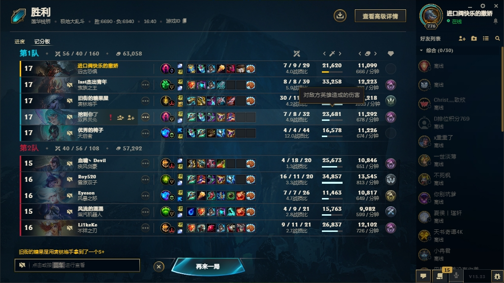
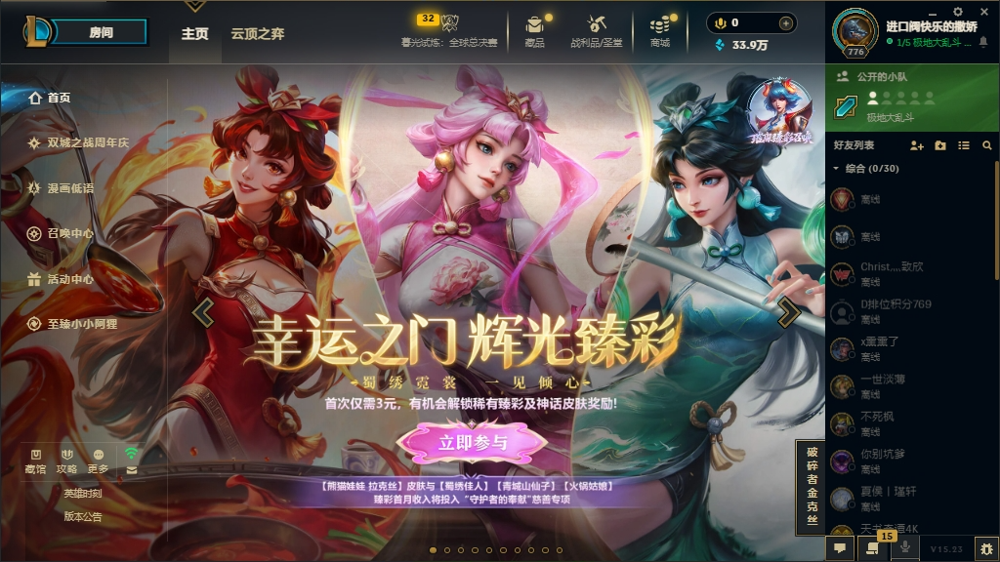
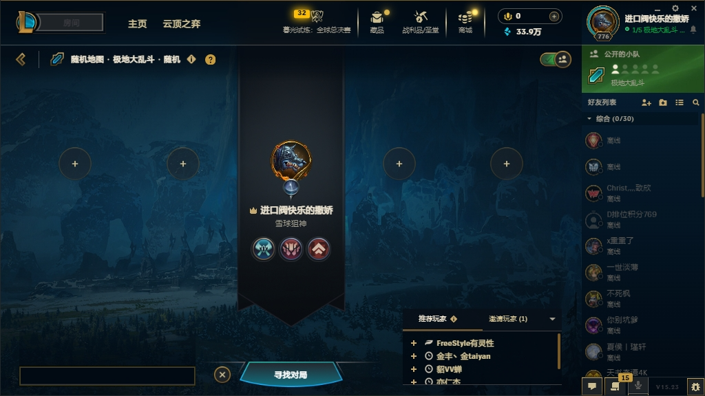

# LOLThemes.Wpf - 英雄联盟风格 WPF 控件库

> **🤖 本项目完全由 AI IDE (Kiro) 自动生成！**  
> 这是一个展示 AI 辅助开发能力的开源项目，从需求分析、设计到实现，全程由 AI 完成。

## 📖 项目简介

LOLThemes.Wpf 是一个开源的 WPF 控件库，为 .NET 8 桌面应用程序提供英雄联盟（League of Legends）游戏客户端的视觉风格。该项目包含完整的主题化控件集合，使开发者能够轻松创建具有 LOL 风格的桌面应用程序。

## ✨ 特性

- 🎨 **完整的主题系统** - 包含 LOL 标志性的金色、深蓝色配色方案
- 🌓 **双主题支持** - 支持暗色和亮色主题，运行时动态切换
- 📏 **尺寸主题系统** - 支持紧凑、中等、宽大三种尺寸主题，满足不同使用场景
- 🎯 **28+ 基础控件样式** - 覆盖所有常用 WPF 控件
- 🔧 **5 个自定义控件** - 六边形按钮、发光按钮、英雄卡片等
- 📦 **最小依赖** - 仅依赖 WPF 框架和 Material.Icons.WPF（用于图标）
- 🎭 **流畅动画效果** - 悬停、点击、焦点等交互动画
- 🔌 **易于集成** - 通过资源字典即可应用主题
- 🎮 **1:1 界面还原** - 示例应用展示游戏界面还原
- 🏗️ **MVVM 架构** - 示例应用采用 MVVM 模式，便于学习和扩展

## 🖼️ 截图展示

项目包含多个界面还原示例，展示控件库的实际效果：





## 🚀 快速开始

### 安装

#### 方式 1: 从源码编译

```bash
# 克隆仓库
git clone https://github.com/yourusername/LOLThemes.git
cd LOLThemes

# 编译控件库
dotnet build src/LOLThemes.Wpf/LOLThemes.Wpf.csproj

# 运行示例应用
dotnet run --project src/LOLThemes.Wpf.Samples/LOLThemes.Wpf.Samples.csproj
```

#### 方式 2: NuGet 包（即将推出）

```bash
dotnet add package LOLThemes.Wpf
```

### 使用方法

1. **在 App.xaml 中引用资源字典**

```xml
<Application x:Class="YourApp.App"
             xmlns="http://schemas.microsoft.com/winfx/2006/xaml/presentation"
             xmlns:x="http://schemas.microsoft.com/winfx/2006/xaml">
    <Application.Resources>
        <ResourceDictionary>
            <ResourceDictionary.MergedDictionaries>
                <!-- 引用 LOL 主题 -->
                <ResourceDictionary Source="pack://application:,,,/LOLThemes.Wpf;component/Themes/Generic.xaml"/>
            </ResourceDictionary.MergedDictionaries>
        </ResourceDictionary>
    </Application.Resources>
</Application>
```

2. **使用控件样式**

```xml
<Window x:Class="YourApp.MainWindow"
        xmlns="http://schemas.microsoft.com/winfx/2006/xaml/presentation"
        xmlns:x="http://schemas.microsoft.com/winfx/2006/xaml">
    <StackPanel Margin="20">
        <!-- 使用 LOL 按钮样式 -->
        <Button Content="主要按钮" 
                Style="{StaticResource LOLPrimaryButtonStyle}" 
                Width="200" Height="40" Margin="0,10"/>
        
        <!-- 使用 LOL 文本框样式 -->
        <TextBox Style="{StaticResource LOLTextBoxStyle}"
                 Tag="请输入用户名..."
                 Width="200" Height="35" Margin="0,10"/>
        
        <!-- 使用 LOL 组合框样式 -->
        <ComboBox Style="{StaticResource LOLComboBoxStyle}"
                  Width="200" Height="35" Margin="0,10">
            <ComboBoxItem Content="选项 1"/>
            <ComboBoxItem Content="选项 2"/>
            <ComboBoxItem Content="选项 3"/>
        </ComboBox>
    </StackPanel>
</Window>
```

3. **使用附加属性扩展控件**

```xml
<Button Content="带图标的按钮"
        Style="{StaticResource LOLButtonStyle}"
        local:ButtonHelper.Shape="Rounded"
        local:ButtonHelper.CornerRadius="5"/>
```

4. **切换主题和尺寸**

```csharp
using LOLThemes.Wpf.Helpers;

// 在 App.xaml.cs 中初始化尺寸主题
public partial class App : Application
{
    protected override void OnStartup(StartupEventArgs e)
    {
        base.OnStartup(e);
        // 初始化尺寸主题（默认：Medium）
        ThemeManager.InitializeSizeTheme(SizeTheme.Medium, this);
    }
}

// 切换主题（暗色/亮色）
ThemeManager.SwitchTheme(Theme.Dark);  // 或 Theme.Light

// 切换尺寸主题（紧凑/中等/宽大）
ThemeManager.SwitchSizeTheme(SizeTheme.Compact);  // 或 SizeTheme.Medium, SizeTheme.Large
```

## 📦 可用控件

### 基础控件样式

LOLThemes.Wpf 为以下 WPF 基础控件提供了完整的样式：

#### 输入控件
- ✅ **Button** - 按钮（已实现）
- ✅ **TextBox** - 文本输入框（已实现）
- ✅ **PasswordBox** - 密码输入框（已实现）
- ✅ **ComboBox** - 组合框/下拉列表（已实现）
- ✅ **CheckBox** - 复选框（已实现）
- ✅ **RadioButton** - 单选按钮（已实现）
- ✅ **ToggleButton** - 切换按钮（已实现）
- ✅ **Slider** - 滑块（已实现）

#### 显示控件
- ✅ **Label** - 标签（已实现）
- ✅ **TextBlock** - 文本块（已实现）
- ✅ **Image** - 图片（已实现）
- ✅ **ProgressBar** - 进度条（已实现）
- ✅ **ToolTip** - 提示框（已实现）

#### 容器控件
- ✅ **Border** - 边框（已实现）
- ✅ **GroupBox** - 分组框（已实现）
- ✅ **Expander** - 展开面板（已实现）
- ✅ **TabControl** - 选项卡控件（已实现）
- ✅ **Window** - 窗口（已实现）

#### 列表控件
- ✅ **ListBox** - 列表框（已实现）
- ✅ **ListView** - 列表视图（已实现）
- ✅ **DataGrid** - 数据网格（已实现）
- ✅ **TreeView** - 树形视图（已实现）

#### 菜单控件
- ✅ **Menu** - 菜单栏（已实现）
- ✅ **MenuItem** - 菜单项（已实现）
- ✅ **ContextMenu** - 上下文菜单（已实现）

#### 其他控件
- ✅ **ScrollBar** - 滚动条（已实现）
- ✅ **StatusBar** - 状态栏（已实现）
- ✅ **Separator** - 分隔符（已实现）
- ✅ **Calendar** - 日历（已实现）
- ✅ **DatePicker** - 日期选择器（已实现）
- ✅ **RichTextBox** - 富文本框（已实现）

### 自定义控件

- ✅ **HexagonButton** - 六边形按钮（已实现）
- ✅ **GlowButton** - 发光边框按钮（已实现）
- ✅ **AnimatedBorder** - 动画边框容器（已实现）
- ✅ **ChampionCard** - 英雄卡片（已实现）
- ✅ **SkillButton** - 技能按钮（支持冷却动画）（已实现）

### 辅助类和转换器

- ✅ **ButtonHelper** - Button 附加属性（已实现）
- ✅ **TextBoxHelper** - TextBox 附加属性（已实现）
- ✅ **CornerRadiusHelper** - 通用圆角辅助（已实现）
- ✅ **GlowEffectHelper** - 发光效果辅助（已实现）
- ✅ **WindowHelper** - Window 附加属性（已实现）
- ✅ **HexToColorConverter** - 十六进制颜色转换器（已实现）
- ✅ **BoolToVisibilityConverter** - 布尔到可见性转换器（已实现）
- ✅ **PercentageConverter** - 百分比转换器（已实现）
- ✅ **LevelToIndentConverter** - TreeView 缩进转换器（已实现）

## 🏗️ 项目结构

```
LOLThemes/
├── src/
│   ├── LOLThemes.Wpf/                    # 核心控件库
│   │   ├── Themes/                       # 主题资源
│   │   │   ├── Generic.xaml              # 主资源字典
│   │   │   ├── Colors.xaml               # 颜色定义
│   │   │   ├── Fonts.xaml                # 字体定义
│   │   │   ├── Animations.xaml           # 动画定义
│   │   │   └── Styles/                   # 控件样式
│   │   │       ├── ButtonStyles.xaml
│   │   │       ├── TextBoxStyles.xaml
│   │   │       └── ...
│   │   ├── Controls/                     # 自定义控件
│   │   ├── Converters/                   # 值转换器
│   │   ├── Helpers/                      # 辅助类
│   │   │   ├── ButtonHelper.cs
│   │   │   ├── TextBoxHelper.cs
│   │   │   └── ...
│   │   └── LOLThemes.Wpf.csproj
│   │
│   └── LOLThemes.Wpf.Samples/            # 示例应用程序
│       ├── Views/                        # 视图页面
│       ├── ViewModels/                   # 视图模型
│       ├── Assets/                       # 资源文件
│       └── LOLThemes.Wpf.Samples.csproj
│
├── Documentation/                        # 文档和截图
│   └── Images/                           # 界面截图
├── LICENSE                               # 许可证
└── README.md                             # 本文件
```

## 🎨 主题颜色

LOLThemes.Wpf 使用英雄联盟的标志性配色方案，支持**暗色主题**和**亮色主题**两种模式，可在运行时动态切换。

### 暗色主题（默认）

| 颜色名称 | 十六进制 | 用途 |
|---------|---------|------|
| 主要金色 | `#C8AA6E` | 强调色、边框、按钮 |
| 深蓝色 | `#010A13` | 主要背景色 |
| 青色 | `#0AC8B9` | 次要强调色、成功状态 |
| 中等背景 | `#1E2328` | 输入框背景 |
| 浅背景 | `#2A2E35` | 悬停背景 |
| 主要文本 | `#F0E6D2` | 主要文本颜色 |
| 次要文本 | `#A09B8C` | 次要文本颜色 |
| 禁用文本 | `#5B5A56` | 禁用状态文本 |

### 亮色主题

亮色主题使用浅色背景和深色文本，提供更好的可读性和现代感，同时保持英雄联盟的设计风格。

## 🤝 贡献指南

我们欢迎所有形式的贡献！无论是报告 Bug、提出新功能建议，还是提交代码改进。

### 如何贡献

1. **Fork 本仓库**
2. **创建特性分支** (`git checkout -b feature/AmazingFeature`)
3. **提交更改** (`git commit -m 'Add some AmazingFeature'`)
4. **推送到分支** (`git push origin feature/AmazingFeature`)
5. **开启 Pull Request**

### 报告问题

如果您发现了 Bug 或有功能建议，请：

1. 在 [Issues](https://github.com/yourusername/LOLThemes/issues) 页面创建新问题
2. 使用清晰的标题和详细的描述
3. 如果是 Bug，请提供复现步骤和环境信息
4. 如果可能，附上截图或代码示例

### 开发指南

- 遵循现有的代码风格和命名约定
- 为新功能添加相应的文档
- 确保代码能够成功编译
- 每个控件样式应该有独立的 XAML 文件
- 使用 Helper 类通过附加属性扩展控件功能

## 📄 许可证

本项目采用 MIT 许可证 - 详见 [LICENSE](LICENSE) 文件

## 🙏 致谢

- **Riot Games** - 感谢英雄联盟提供的视觉设计灵感
- **AI 技术** - 本项目完全由 AI IDE (Kiro) 生成，展示了 AI 辅助开发的强大能力
- **开源社区** - 感谢所有为开源项目做出贡献的开发者

## 📞 联系方式

- 项目主页: [https://github.com/yourusername/LOLThemes](https://github.com/yourusername/LOLThemes)
- 问题反馈: [https://github.com/yourusername/LOLThemes/issues](https://github.com/yourusername/LOLThemes/issues)

## 🔮 未来计划

- [x] 完成所有 28+ 基础控件样式 ✅
- [x] 实现所有 5 个自定义控件（HexagonButton, GlowButton, AnimatedBorder, ChampionCard, SkillButton）✅
- [x] 添加更多主题变体（暗色/亮色）✅
- [x] 支持主题动态切换 ✅
- [x] 实现尺寸主题切换（紧凑/中等/宽大）✅
- [ ] 发布 NuGet 包
- [ ] 创建交互式文档网站
- [ ] 添加更多示例和教程
- [ ] 添加更多 LOL 特色控件

---

⭐ 如果这个项目对您有帮助，请给我们一个 Star！

🤖 **再次强调：本项目完全由 AI 自动生成，展示了 AI 在软件开发领域的巨大潜力！**
